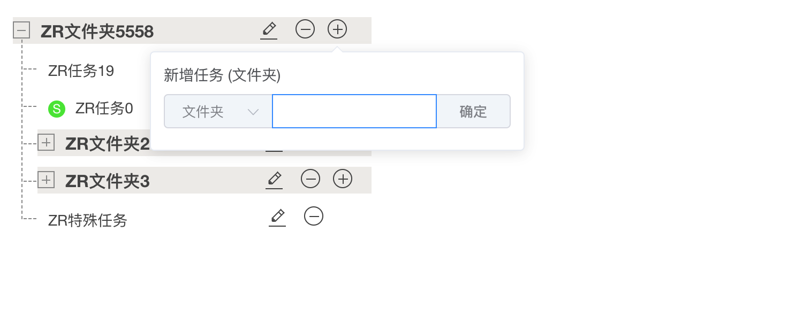

# vf-ui

## 项目简介

VF-UI TS VUE 组件框架

<p>
  <a href="https://www.npmjs.com/package/vf-vue-ui">
    
  </a>
  <a href="https://www.npmjs.com/package/vf-vue-ui">
    
  </a>
  <a href="https://www.npmjs.com/package/vf-vue-ui">
    
  </a>
   <a href="https://www.npmjs.com/package/vf-vue-ui">
    
  </a>
  <a href="https://www.npmjs.com/package/vf-vue-ui">
    
  </a>
</p>

## Project setup

```bash
npm install

// run example
npm run dev
```

## How to use

```
npm install --save vf-vue-ui
```

```js
import Vue from "vue";
import VFUI from "vf-vue-ui";
import "vf-vue-ui/lib/theme/index.css";

// 安装组件
Vue.use(VFUI);
```

## 主要功能

- [vf-alert](./packages/alert/docs/info.md)

- [vf-task-tree](./packages/task-tree/docs/info.md)

- VfMedal

## 组件展示

- vf-task-tree


